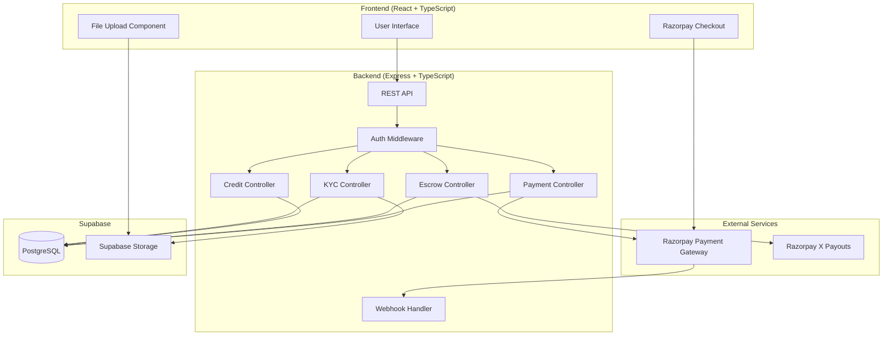
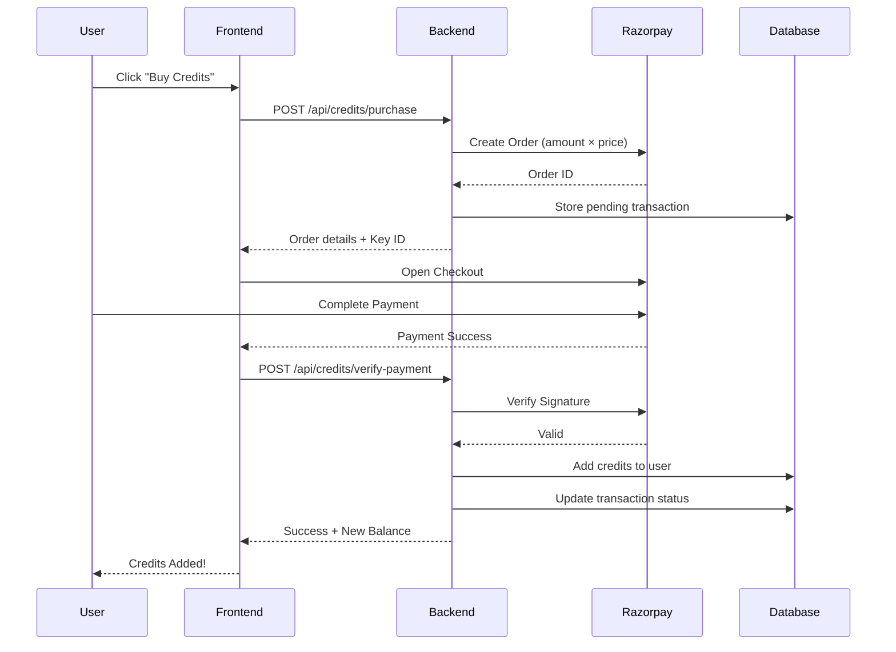
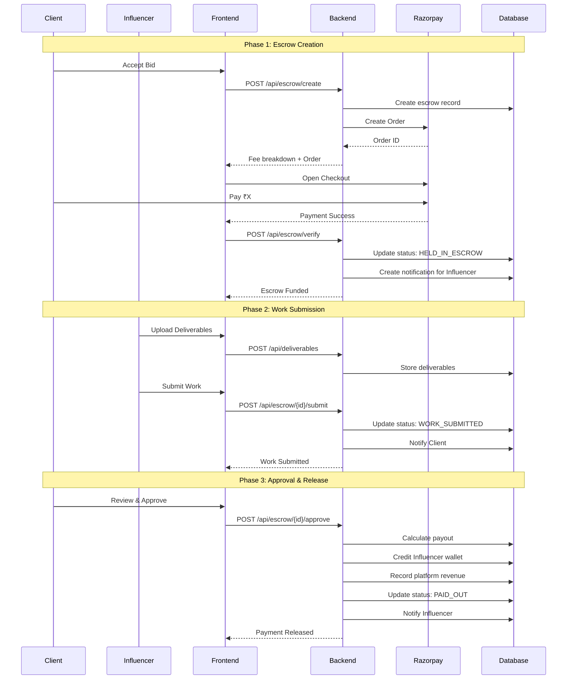
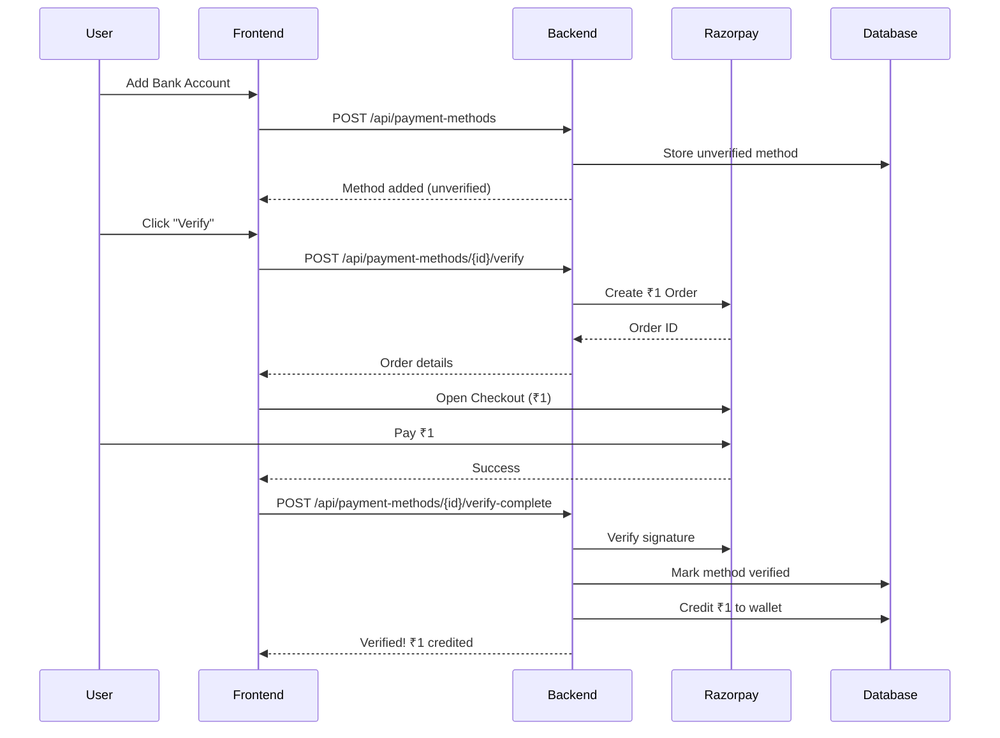

# Design Document: Production Escrow Payment System

## Overview

This design document outlines the architecture and implementation details for a production-grade Escrow Payment System for the Adfluencer influencer marketplace. The system handles real money transactions in Indian Rupees (INR) using Razorpay as the payment gateway, with comprehensive escrow management, credit-based posting/bidding, KYC verification, and admin controls.

### Key Design Principles

1. **Real Money Transactions**: All payments are processed through Razorpay with actual fund transfers
2. **Security First**: KYC verification, payment method validation, and secure file storage
3. **Transparency**: Clear fee breakdowns and audit trails for all transactions
4. **Dispute Protection**: Escrow holds funds until work is approved, with dispute resolution
5. **Admin Control**: Comprehensive dashboard for platform management

## Architecture



## Components and Interfaces

### 1. Credit System Service

```typescript
interface CreditService {
  // Get user's credit balance
  getUserCredits(userId: string): Promise<UserCredits>;
  
  // Purchase credits with Razorpay
  purchaseCredits(userId: string, creditType: 'BID' | 'POST', quantity: number): Promise<RazorpayOrder>;
  
  // Verify credit purchase payment
  verifyPurchase(userId: string, orderId: string, paymentId: string, signature: string): Promise<CreditTransaction>;
  
  // Use credit for action
  useCredit(userId: string, creditType: 'BID' | 'POST', resourceId: string): Promise<CreditResult>;
  
  // Admin: Adjust user credits
  adjustCredits(adminId: string, userId: string, creditType: 'BID' | 'POST', amount: number, reason: string): Promise<CreditTransaction>;
  
  // Admin: Toggle credit system
  toggleCreditSystem(adminId: string, enabled: boolean): Promise<CreditSettings>;
}

interface UserCredits {
  id: string;
  userId: string;
  bidCredits: number;
  postCredits: number;
  totalBidCreditsUsed: number;
  totalPostCreditsUsed: number;
}

interface CreditSettings {
  creditSystemEnabled: boolean;
  bidCreditPrice: number;  // ₹5
  postCreditPrice: number; // ₹10
}
```

### 2. Wallet Service

```typescript
interface WalletService {
  // Get wallet balance
  getWallet(userId: string): Promise<UserWallet>;
  
  // Create top-up order
  createTopUpOrder(userId: string, amount: number): Promise<RazorpayOrder>;
  
  // Verify top-up payment
  verifyTopUp(userId: string, orderId: string, paymentId: string, signature: string): Promise<WalletTransaction>;
  
  // Credit wallet (internal - for escrow release)
  creditWallet(userId: string, amount: number, description: string, metadata: object): Promise<WalletTransaction>;
  
  // Debit wallet (internal - for payments)
  debitWallet(userId: string, amount: number, description: string, metadata: object): Promise<WalletTransaction>;
  
  // Lock funds (for disputes)
  lockFunds(userId: string, amount: number, reason: string): Promise<WalletTransaction>;
  
  // Unlock funds
  unlockFunds(userId: string, amount: number, reason: string): Promise<WalletTransaction>;
  
  // Request withdrawal
  requestWithdrawal(userId: string, amount: number, paymentMethodId: string): Promise<WithdrawalRequest>;
}

interface UserWallet {
  id: string;
  userId: string;
  balance: number;
  lockedBalance: number;
  currency: 'INR';
}
```

### 3. Escrow Service

```typescript
interface EscrowService {
  // Calculate fee breakdown
  calculateFees(grossAmount: number): FeeBreakdown;
  
  // Create escrow for contract
  createEscrow(clientId: string, contractId: string): Promise<EscrowTransaction>;
  
  // Verify escrow payment
  verifyEscrowPayment(escrowId: string, orderId: string, paymentId: string, signature: string): Promise<EscrowTransaction>;
  
  // Submit work (influencer)
  submitWork(escrowId: string, influencerId: string): Promise<EscrowTransaction>;
  
  // Approve and release (client)
  approveAndRelease(escrowId: string, clientId: string): Promise<PayoutResult>;
  
  // Request revision (client)
  requestRevision(escrowId: string, clientId: string, feedback: string): Promise<EscrowTransaction>;
  
  // Raise dispute
  raiseDispute(escrowId: string, userId: string, reason: string, description: string, evidence: string[]): Promise<Dispute>;
  
  // Request refund (before work submitted)
  requestRefund(escrowId: string, clientId: string, reason: string): Promise<RefundResult>;
  
  // Admin: Resolve dispute
  resolveDispute(disputeId: string, adminId: string, resolution: DisputeResolution): Promise<Dispute>;
}

interface FeeBreakdown {
  grossAmount: number;      // What client pays
  razorpayFee: number;      // ~2.36%
  platformFee: number;      // 10%
  providerPayout: number;   // What influencer receives
  platformEarnings: number; // Platform revenue
}

interface EscrowTransaction {
  id: string;
  contractId: string;
  clientId: string;
  providerId: string;
  grossAmount: number;
  razorpayFee: number;
  platformFee: number;
  providerPayout: number;
  escrowStatus: EscrowStatus;
  paymentStatus: PaymentStatus;
  razorpayOrderId?: string;
  razorpayPaymentId?: string;
}

type EscrowStatus = 
  | 'CREATED'
  | 'HELD_IN_ESCROW'
  | 'WORK_SUBMITTED'
  | 'APPROVED'
  | 'PAYOUT_INITIATED'
  | 'PAID_OUT'
  | 'DISPUTED'
  | 'REFUNDED';
```

### 4. KYC & Payment Method Service

```typescript
interface KYCService {
  // Submit KYC documents
  submitKYC(userId: string, kycData: KYCSubmission): Promise<KYCVerification>;
  
  // Get KYC status
  getKYCStatus(userId: string): Promise<KYCVerification>;
  
  // Add payment method
  addPaymentMethod(userId: string, method: PaymentMethodInput): Promise<PaymentMethod>;
  
  // Verify payment method with ₹1 charge
  verifyPaymentMethod(userId: string, paymentMethodId: string): Promise<VerificationResult>;
  
  // Admin: Review KYC
  reviewKYC(adminId: string, kycId: string, status: 'APPROVED' | 'REJECTED', reason?: string): Promise<KYCVerification>;
}

interface PaymentMethod {
  id: string;
  userId: string;
  methodType: 'BANK_ACCOUNT' | 'UPI';
  accountDetails: BankAccountDetails | UPIDetails;
  isVerified: boolean;
  isPrimary: boolean;
  verificationChargeId?: string;
}

interface BankAccountDetails {
  accountHolderName: string;
  accountNumber: string;
  ifscCode: string;
  bankName: string;
  accountType: 'savings' | 'current';
}

interface UPIDetails {
  upiId: string;
  verifiedName?: string;
}
```

### 5. File Storage Service

```typescript
interface StorageService {
  // Upload KYC document
  uploadKYCDocument(userId: string, documentType: string, file: File): Promise<StorageResult>;
  
  // Upload deliverable
  uploadDeliverable(contractId: string, file: File): Promise<StorageResult>;
  
  // Upload profile image
  uploadProfileImage(userId: string, file: File): Promise<StorageResult>;
  
  // Get signed URL for secure access
  getSignedUrl(path: string, expiresIn: number): Promise<string>;
  
  // Delete file
  deleteFile(path: string): Promise<void>;
}

interface StorageResult {
  path: string;
  publicUrl: string;
  signedUrl: string;
  size: number;
  mimeType: string;
}
```

## Data Models

### Database Schema Extensions

```sql
-- Payment Method for withdrawals
CREATE TABLE "PaymentMethodVerification" (
    "id" TEXT PRIMARY KEY DEFAULT gen_random_uuid()::text,
    "userId" TEXT NOT NULL REFERENCES "User"("id"),
    "paymentMethodId" TEXT NOT NULL REFERENCES "PaymentMethod"("id"),
    "verificationAmount" NUMERIC(10,2) DEFAULT 1.00,
    "razorpayOrderId" TEXT,
    "razorpayPaymentId" TEXT,
    "status" TEXT DEFAULT 'PENDING' CHECK (status IN ('PENDING', 'SUCCESS', 'FAILED')),
    "failureReason" TEXT,
    "createdAt" TIMESTAMP DEFAULT CURRENT_TIMESTAMP,
    "verifiedAt" TIMESTAMP
);

-- Withdrawal Requests
CREATE TABLE "WithdrawalRequest" (
    "id" TEXT PRIMARY KEY DEFAULT gen_random_uuid()::text,
    "userId" TEXT NOT NULL REFERENCES "User"("id"),
    "paymentMethodId" TEXT NOT NULL REFERENCES "PaymentMethod"("id"),
    "amount" NUMERIC(12,2) NOT NULL,
    "status" TEXT DEFAULT 'PENDING' CHECK (status IN ('PENDING', 'PROCESSING', 'COMPLETED', 'FAILED', 'CANCELLED')),
    "razorpayPayoutId" TEXT,
    "failureReason" TEXT,
    "processedAt" TIMESTAMP,
    "createdAt" TIMESTAMP DEFAULT CURRENT_TIMESTAMP
);

-- Dispute Evidence
CREATE TABLE "DisputeEvidence" (
    "id" TEXT PRIMARY KEY DEFAULT gen_random_uuid()::text,
    "disputeId" TEXT NOT NULL REFERENCES "Dispute"("id"),
    "uploadedBy" TEXT NOT NULL REFERENCES "User"("id"),
    "fileUrl" TEXT NOT NULL,
    "fileType" TEXT NOT NULL,
    "description" TEXT,
    "createdAt" TIMESTAMP DEFAULT CURRENT_TIMESTAMP
);

-- Platform Revenue Summary (for admin dashboard)
CREATE TABLE "RevenueSummary" (
    "id" TEXT PRIMARY KEY DEFAULT gen_random_uuid()::text,
    "date" DATE NOT NULL UNIQUE,
    "totalEscrowCreated" NUMERIC(12,2) DEFAULT 0,
    "totalEscrowReleased" NUMERIC(12,2) DEFAULT 0,
    "totalPlatformFees" NUMERIC(12,2) DEFAULT 0,
    "totalCreditPurchases" NUMERIC(12,2) DEFAULT 0,
    "totalWithdrawals" NUMERIC(12,2) DEFAULT 0,
    "createdAt" TIMESTAMP DEFAULT CURRENT_TIMESTAMP,
    "updatedAt" TIMESTAMP DEFAULT CURRENT_TIMESTAMP
);
```

### Supabase Storage Buckets

```
Buckets:
├── kyc-documents (private)
│   └── {userId}/
│       ├── aadhaar-front.jpg
│       ├── aadhaar-back.jpg
│       ├── pan.jpg
│       └── selfie.jpg
│
├── deliverables (private)
│   └── {contractId}/
│       ├── screenshot-1.png
│       ├── analytics-report.pdf
│       └── video-proof.mp4
│
├── profiles (public)
│   └── {userId}/
│       └── avatar.jpg
│
└── dispute-evidence (private)
    └── {disputeId}/
        └── evidence-{timestamp}.{ext}
```

## Payment Flow Diagrams

### Credit Purchase Flow



### Escrow Payment Flow



### Payment Method Verification Flow



## Error Handling

### Payment Errors

| Error Code | Description | User Message | Action |
|------------|-------------|--------------|--------|
| `PAYMENT_FAILED` | Razorpay payment failed | "Payment failed. Please try again." | Retry payment |
| `SIGNATURE_INVALID` | Payment signature mismatch | "Payment verification failed." | Contact support |
| `INSUFFICIENT_CREDITS` | Not enough credits | "Insufficient credits. Please purchase more." | Redirect to purchase |
| `INSUFFICIENT_BALANCE` | Wallet balance too low | "Insufficient wallet balance." | Redirect to top-up |
| `ESCROW_NOT_FOUND` | Invalid escrow ID | "Transaction not found." | Check transaction ID |
| `INVALID_STATUS` | Wrong escrow status for action | "This action is not available." | Show current status |
| `WITHDRAWAL_LIMIT` | Exceeds withdrawal limit | "Amount exceeds available balance." | Adjust amount |
| `UNVERIFIED_METHOD` | Payment method not verified | "Please verify your payment method first." | Redirect to verification |

### Webhook Error Handling

```typescript
// Webhook retry strategy
const webhookConfig = {
  maxRetries: 3,
  retryDelays: [1000, 5000, 30000], // 1s, 5s, 30s
  idempotencyCheck: true,
  logAllEvents: true,
};

// Webhook event handlers
const webhookHandlers = {
  'payment.captured': handlePaymentCaptured,
  'payment.failed': handlePaymentFailed,
  'refund.created': handleRefundCreated,
  'payout.processed': handlePayoutProcessed,
  'payout.failed': handlePayoutFailed,
};
```

## Testing Strategy

### Dual Testing Approach

This system requires both unit tests and property-based tests:

- **Unit Tests**: Verify specific payment scenarios, edge cases, and error conditions
- **Property-Based Tests**: Verify universal properties that should hold across all inputs

### Testing Framework

- **Unit Testing**: Vitest
- **Property-Based Testing**: fast-check
- **API Testing**: Supertest
- **Mocking**: Razorpay test mode with test credentials

### Test Categories

1. **Credit System Tests**
   - Credit purchase flow
   - Credit deduction
   - Insufficient credits handling
   - Admin credit adjustments

2. **Wallet Tests**
   - Top-up flow
   - Balance calculations
   - Lock/unlock funds
   - Withdrawal processing

3. **Escrow Tests**
   - Fee calculation accuracy
   - Status transitions
   - Payment verification
   - Payout calculations

4. **KYC Tests**
   - Document upload
   - Verification flow
   - ₹1 charge processing

5. **Integration Tests**
   - Complete escrow lifecycle
   - Dispute resolution flow
   - Webhook processing


## Correctness Properties

*A property is a characteristic or behavior that should hold true across all valid executions of a system-essentially, a formal statement about what the system should do. Properties serve as the bridge between human-readable specifications and machine-verifiable correctness guarantees.*

Based on the acceptance criteria analysis, the following correctness properties must be verified through property-based testing:

### Property 1: Credit Purchase Order Amount Calculation
*For any* credit type (BID or POST) and any positive quantity, the Razorpay order amount SHALL equal quantity × unit price (₹5 for BID, ₹10 for POST).

**Validates: Requirements 1.1, 1.2**

### Property 2: Credit Balance Update on Purchase
*For any* successful credit purchase payment, the user's credit balance SHALL increase by exactly the purchased quantity.

**Validates: Requirements 1.3**

### Property 3: Credit Deduction on Action
*For any* user with credits > 0 performing a credit-consuming action (posting or bidding), the corresponding credit balance SHALL decrease by exactly 1.

**Validates: Requirements 1.4, 1.5**

### Property 4: Free Actions When Credit System Disabled
*For any* user and any action (posting or bidding), when the credit system is disabled, the action SHALL succeed regardless of the user's credit balance.

**Validates: Requirements 1.7**

### Property 5: Wallet Balance Update on Payment
*For any* successful wallet top-up, escrow release, or refund, the user's wallet balance SHALL change by exactly the transaction amount (positive for credits, negative for debits).

**Validates: Requirements 2.2, 2.3, 6.2, 7.5, 7.6, 8.2**

### Property 6: Dispute Fund Locking
*For any* active dispute on an escrow, the disputed amount SHALL be reflected in the locked balance of the relevant user's wallet.

**Validates: Requirements 2.6**

### Property 7: UPI ID Format Validation
*For any* string input as UPI ID, the system SHALL accept only strings matching the pattern `[a-zA-Z0-9._-]+@[a-zA-Z]+` and reject all others.

**Validates: Requirements 3.2**

### Property 8: Payment Method Verification Wallet Credit
*For any* successful ₹1 payment method verification, the user's wallet balance SHALL increase by exactly ₹1 AND the payment method SHALL be marked as verified.

**Validates: Requirements 3.4**

### Property 9: File Storage Path Pattern
*For any* file upload, the storage path SHALL follow the pattern:
- KYC documents: `kyc/{userId}/{documentType}/{filename}`
- Deliverables: `deliverables/{contractId}/{filename}`
- Profile images: `profiles/{userId}/{filename}`

**Validates: Requirements 3.7, 5.2, 10.1, 10.2, 10.3**

### Property 10: Escrow Fee Calculation Consistency
*For any* gross amount, the fee breakdown SHALL satisfy:
- `razorpayFee = grossAmount × 0.0236` (rounded to 2 decimals)
- `platformFee = grossAmount × 0.10` (rounded to 2 decimals)
- `providerPayout = grossAmount - razorpayFee - platformFee`
- `grossAmount = razorpayFee + platformFee + providerPayout`

**Validates: Requirements 4.1, 4.2, 6.1**

### Property 11: Escrow Order Amount Consistency
*For any* escrow creation, the Razorpay order amount SHALL equal the escrow's gross amount.

**Validates: Requirements 4.3**

### Property 12: Escrow Status Transitions
*For any* escrow, the status transitions SHALL follow the valid state machine:
- `CREATED` → `HELD_IN_ESCROW` (on payment verification)
- `HELD_IN_ESCROW` → `WORK_SUBMITTED` (on work submission)
- `HELD_IN_ESCROW` → `REFUNDED` (on refund request)
- `HELD_IN_ESCROW` → `DISPUTED` (on dispute)
- `WORK_SUBMITTED` → `APPROVED` (on approval)
- `WORK_SUBMITTED` → `DISPUTED` (on dispute)
- `APPROVED` → `PAID_OUT` (on payout)
- `DISPUTED` → `REFUNDED` | `PAID_OUT` (on resolution)

**Validates: Requirements 4.4, 5.3, 5.6, 6.4, 7.2, 8.3**

### Property 13: Revision Request Status Preservation
*For any* revision request on an escrow with status `WORK_SUBMITTED`, the escrow status SHALL remain `WORK_SUBMITTED`.

**Validates: Requirements 5.5**

### Property 14: Wallet Transaction Record Creation
*For any* wallet balance change, a corresponding wallet transaction record SHALL exist with:
- Correct `balanceBefore` and `balanceAfter` values
- Reference to the source (escrow ID, payment ID, etc.)
- Accurate `amount` matching the balance difference

**Validates: Requirements 6.3, 11.1, 11.3**

### Property 15: Platform Revenue Recording
*For any* completed escrow payout, a platform revenue record SHALL exist with amount equal to the escrow's platform fee.

**Validates: Requirements 6.6**

### Property 16: Dispute Split Distribution
*For any* dispute resolved as split with percentages (clientPercent, influencerPercent), the sum of distributed amounts SHALL equal the available escrow amount (gross - razorpayFee), and `clientPercent + influencerPercent = 100`.

**Validates: Requirements 7.7**

### Property 17: Refund Status Restriction
*For any* escrow with status other than `HELD_IN_ESCROW`, a direct refund request SHALL be rejected.

**Validates: Requirements 8.1, 8.5**

### Property 18: File Access Authorization
*For any* file access request, the system SHALL grant access only if the requesting user is the owner, a party to the related contract, or an admin.

**Validates: Requirements 10.4**

### Property 19: Signed URL Expiration
*For any* generated signed URL, the URL SHALL contain an expiration parameter with a future timestamp.

**Validates: Requirements 10.5**

### Property 20: Audit Trail Completeness
*For any* financial transaction (payment, escrow status change, wallet change, admin action), a corresponding audit record SHALL exist with timestamp, user ID, action type, and relevant metadata.

**Validates: Requirements 11.1, 11.2, 11.3, 11.4, 11.5**
